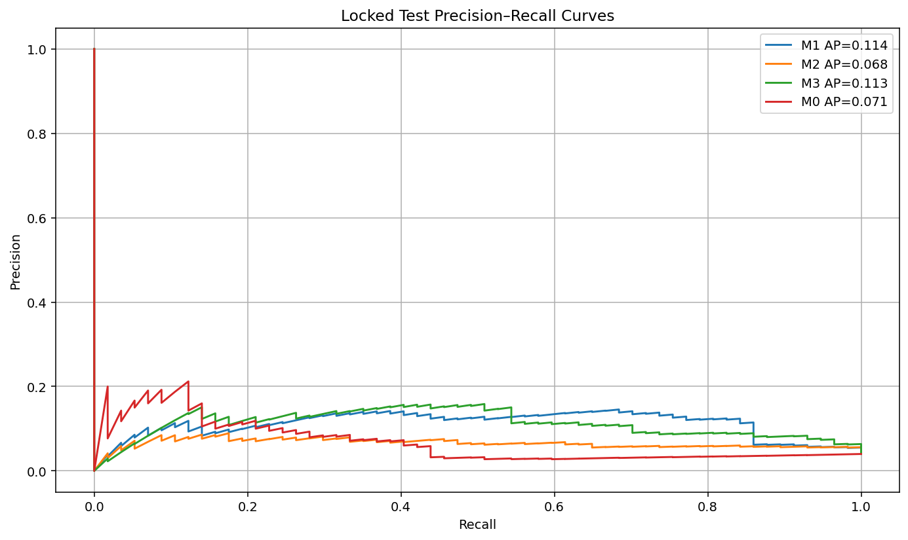

# Cross-Asset Early Warning for High-Yield Credit Stress

Reproducible Python research project testing whether prespecified cross-asset dislocation features improve early warning of large HYG losses over the next 10 trading days.

## Final result

The locked primary conclusion is **No reliable improvement**. M2 (12-feature cross-asset logistic) improved on M1 (HYG-only logistic) during 2017–2020 validation, but not in the locked 2021–2026 test. Test PR-AUC was 0.1136 for M1 and 0.0675 for M2; the paired 20-trading-day moving-block bootstrap 95% interval for M2−M1 was [-0.1396, 0.0196]. M1's locked threshold also drifted to a 19.3% alert rate and about 42 false-alert days/year.

This is a **risk-monitoring study, not a trading strategy or trading backtest**, and it does not claim reliable crisis prediction.

### Locked test snapshot

| Model | Description | Test PR-AUC |
|---|---|---:|
| M0 | Negative HYG 5-day-return baseline | 0.0710 |
| M1 | HYG-only L2 logistic | 0.1136 |
| M2 | 12-feature cross-asset L2 logistic | 0.0675 |
| M3 | Prescribed random forest | 0.1132 |



**[Read the complete final research report](outputs/reports/final_research_report.md)**

## Data

ETF inputs are adjusted prices for HYG, LQD, IEF and SPY from Yahoo Finance via `yfinance`. VIX is FRED `VIXCLS` (CBOE source). ETF adjusted-price fields are used as provided; raw Close is not silently substituted.

**Raw provider files are intentionally excluded from the public GitHub repository.** Third-party market data are not redistributed or relicensed by this project. The saved Phase-B derived dataset included in the research outputs supports deterministic reproduction of the locked Phase D and Phase E analyses without redistributing the original provider files. Phase A data acquisition can be rerun separately with network access using the acquisition dependencies.

## Models

M0 is a negative HYG 5-day-return baseline. M1 is a standardized HYG-only L2 logistic model (`C=0.1`). M2 is the standardized 12-feature L2 logistic model (`C=0.1`). M3 is the prescribed 500-tree random forest (`max_depth=3`, `min_samples_leaf=100`). Logistic models use balanced class weights, so their outputs are treated as model/risk scores rather than calibrated probabilities.

## Commands

Create a clean portable environment:

```bash
python -m venv .venv
source .venv/bin/activate
python -m pip install -r requirements-lock.txt
```

`requirements-lock.txt` contains only portable project Python dependencies and contains no local `file:///` paths or OpenAI/runtime-specific packages. `environment_snapshot.txt` is retained only as provenance for the original runtime and is **not** an installable environment specification. Data-acquisition adapters remain separate in `requirements-data-acquisition.txt`.

Run the project tests:

```bash
python -m pytest -q
```

Verify saved-prediction Phase-D metrics:

```bash
python scripts/run_phase_d.py --verify
```

Run the slow full Phase-D walk-forward refit reproduction:

```bash
python scripts/run_phase_d.py --verify-full
```

Regenerate Phase E diagnostics and figures, then verify them:

```bash
python scripts/run_phase_e.py
python scripts/run_phase_e.py --verify
```

Earlier phase runners remain available for the audited pipeline stages.

## Repository structure

- `config.yaml` — fixed project dates, horizon, refit cadence and robustness window.
- `data/raw/` — ignored placeholder for locally acquired provider files; raw third-party market data are not published.
- `src/credit_warning/` — data audit, feature/label, model and evaluation utilities.
- `scripts/` — phase runners, including the repaired `run_phase_d.py`.
- `tests/` — deterministic unit/integration tests.
- `outputs/tables/` — Phase B–E derived tables, locked predictions and robustness diagnostics.
- `outputs/reports/` — audit reports, locked test report, final research report, run logs and diffs.
- `outputs/figures/` — locked Phase-D figures plus corrected Phase-E diagnostics.
- `requirements-lock.txt` — portable pinned direct/transitive project dependencies.
- `environment_snapshot.txt` — original full runtime snapshot retained for provenance only; not installable.
- `requirements.txt` — concise Phase-D/Phase-E runtime requirements.
- `requirements-data-acquisition.txt` — optional Phase-A network acquisition dependencies.

The obsolete notebooks that still claimed the project stopped at Phase A were removed in Phase E.

## Reproducibility and leakage controls

Hyperparameters were selected only in purged chronological initial-training folds. Validation and test inference refit every 21 trading days. A training row is eligible only when its `label_end_date` is strictly before the prediction block. Scaling is fitted inside each logistic refit. Phase D uses the Phase-C locked hyperparameters and thresholds without test retuning.

Phase E adds a five-year rolling-window robustness check, bootstrap block-length sensitivity, a clearly retrospective equal-alert-budget diagnostic, feature drift/correlation analysis and coefficient-sign diagnostics. None changes the locked primary result.

## Limitations

The target is a future HYG ETF trough, not default. Ten-day labels overlap and test stress is concentrated: 45 of 57 positive days and 14 of 17 episodes occur in 2022. Balanced-class-weight scores are poorly calibrated in absolute-probability terms. Fixed thresholds drift out of budget. The sample contains few independent stress episodes, the analysis is observational, and no trading P&L or causal effect is estimated. None of the models is ready for production deployment or trading use.

See `outputs/reports/final_research_report.md` for the complete methodology, results, robustness analysis and interpretation.
