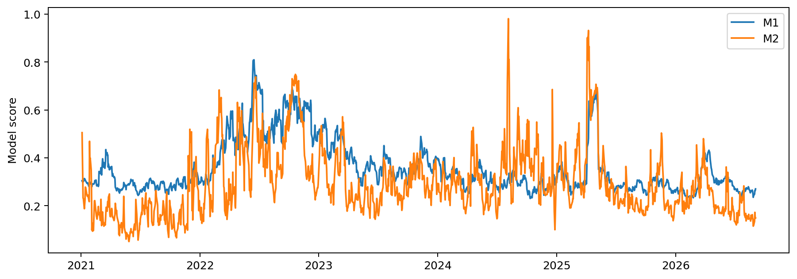
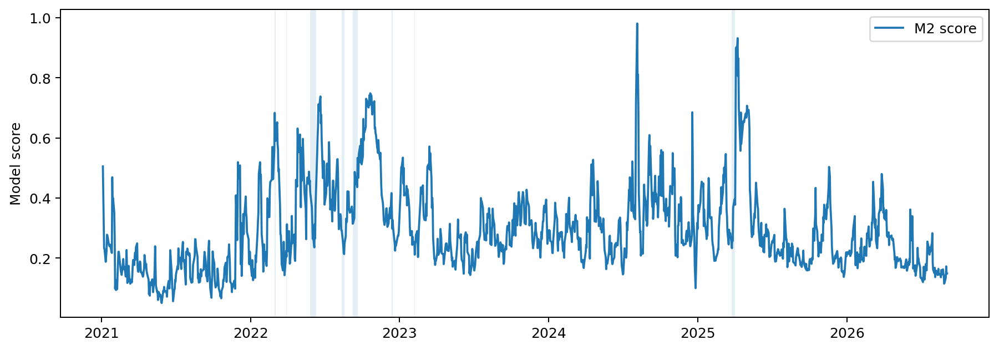
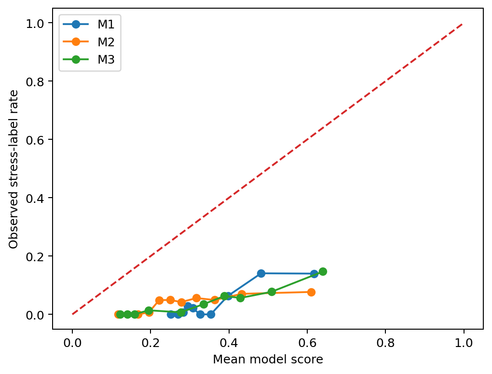
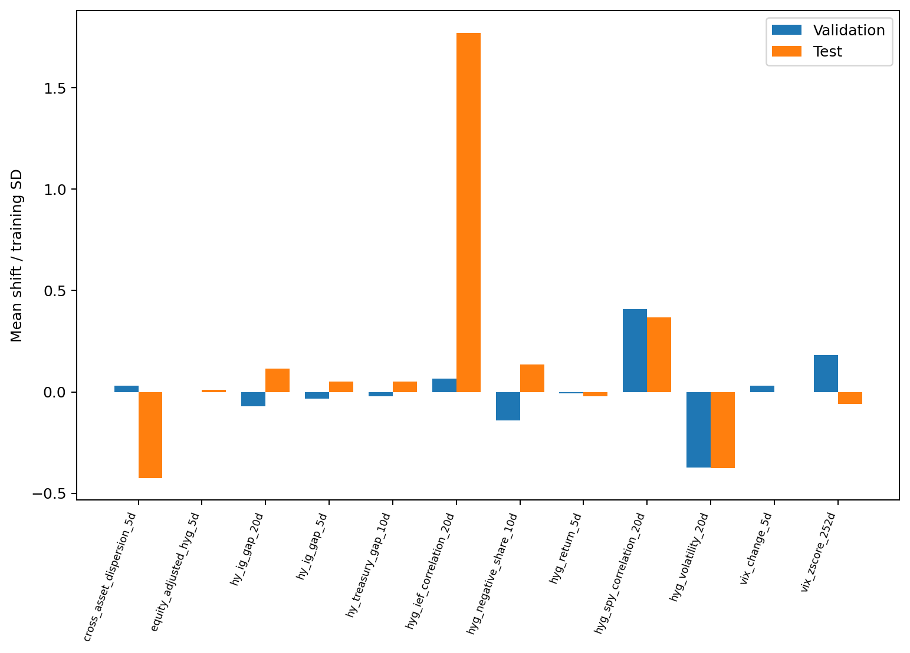
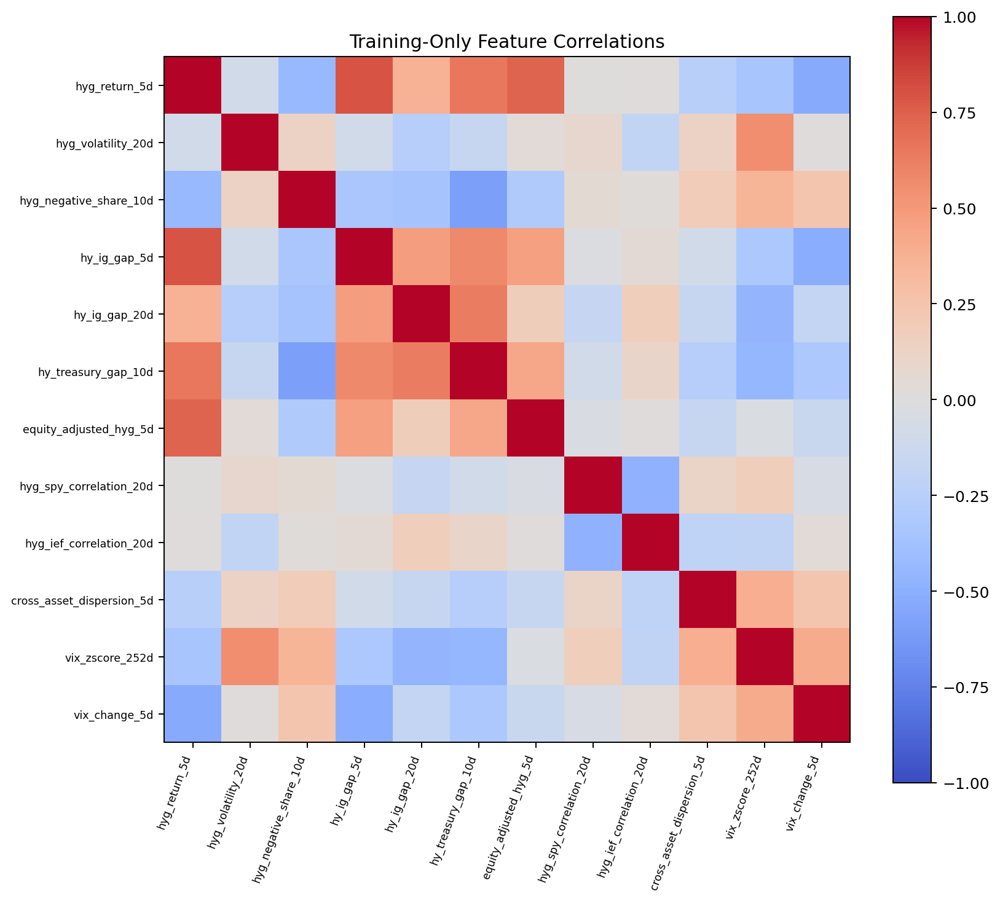

# Cross-Asset Early Warning for High-Yield Credit Stress
## Final Research Report — Phase E

## 1. Executive summary

This project asks whether cross-asset dislocation signals improve early warning of large near-term losses in HYG relative to information contained in HYG itself. The design was fixed before the locked test: adjusted ETF prices for HYG, LQD, IEF and SPY plus VIX; twelve prespecified features; a 10-trading-day future-trough stress label; chronological/purged training; 21-trading-day walk-forward refits; and fixed Phase-C hyperparameters and alert thresholds.

The locked 2021–2026 test contains 1,424 eligible observations. M1, the HYG-only logistic model, achieved PR-AUC **0.1136**. M2, the 12-feature cross-asset logistic model, achieved **0.0675**, a difference of **−0.0460**. The paired 20-day moving-block bootstrap 95% interval for M2−M1 was **[−0.1396, 0.0196]**. M1 detected 13 of 17 stress episodes; M2 detected 5. The predeclared Phase-D conclusion therefore remains **No reliable improvement**.

The result is not a claim that cross-asset information is never useful. M2 was substantially stronger in the 2017–2020 walk-forward validation period (PR-AUC 0.4041 versus 0.2501 for M1), but that advantage did not generalize. M2 also underperformed M1 in the initial-training purged cross-validation (0.1132 versus 0.1867). The five-year rolling-window robustness check likewise favors M1 on test PR-AUC (0.1130 versus 0.0619).

The logistic models use `class_weight="balanced"`. Their outputs are therefore described here as **model scores / risk scores**, not calibrated probabilities. Absolute calibration is poor. M2's lower test Brier score does not outweigh its weaker ranking, recall, and episode detection. M1's strong locked-threshold recall came with material operational cost: a **19.3% alert rate** and roughly **41.7 false-alert days per year**. M3 nearly matched M1's ranking (PR-AUC 0.1132) but is secondary to the predeclared M2-versus-M1 hypothesis test. None of the models is ready for production deployment or trading use.

> **Principal conclusion:** “Cross-asset dislocation features improved performance during the 2017–2020 validation period but did not improve early warning in the locked 2021–2026 test. Under the specified design, recent HYG behavior generalized better than the larger cross-asset feature set, although its operational threshold also produced substantial alert-rate drift and false alerts.”

## 2. Research question and hypotheses

The primary question is whether prespecified cross-asset dislocation features improve early warning of severe HYG losses over the next 10 trading days beyond a compact HYG-only model. M1 is the HYG-only reference; M2 is the primary cross-asset alternative. M0 is a simple negative-HYG-return baseline and M3 is a nonlinear random-forest comparator. The primary inferential comparison is M2 versus M1, not a search for whichever model scores best after the fact.

The Phase-D interpretation rule was fixed before the locked test. Strong evidence required higher M2 test PR-AUC, a paired-bootstrap confidence interval for the difference above zero, and episode detection not worse. Suggestive evidence required higher PR-AUC with an interval crossing zero and directionally supportive episode results. Otherwise the result was classified as no reliable improvement.

## 3. Financial motivation

High-yield credit can weaken alongside investment-grade credit, Treasuries, equities, and volatility markets, but those relationships are state dependent. A monitoring system may therefore benefit from signals that distinguish HYG-specific weakness from broad risk-off moves or unusual cross-asset dispersion. The design tests that idea without turning the exercise into a trading backtest. The target is an ETF drawdown-style outcome, not default, spread loss, or a causal measure of credit deterioration.

## 4. Data and adjusted-price conventions

ETF inputs are HYG, LQD, IEF and SPY adjusted prices from Yahoo Finance via `yfinance`; VIX is FRED `VIXCLS` (CBOE source). Phase A retained the provider's adjusted-price field for ETFs rather than substituting raw close. ETF observations were aligned to HYG trading dates without forward filling. VIX was audited before alignment; no valid VIX observation was removed or winsorized, and the 20% daily-change rule was diagnostic only.

The audited common ETF/VIX sample begins with HYG's first valid adjusted observation on 2007-04-11 and extends through 2026-09-18. The configured project start remains 2007-04-04; the Phase-A coverage gate correctly uses HYG's actual observed span for comparison-ETF coverage.

## 5. Target and episode construction

For each date, the target is HYG's worst cumulative return over the next 10 trading days, together with the date of that trough. `label_end_date` marks the end of the 10-day outcome window. The stress cutoff is the 10th percentile calculated only from eligible initial-training outcomes. A positive stress label indicates a future-trough return at or below that fixed cutoff. The numerical training stress cutoff is **-0.030244246702**, approximately **-3.0244%**.

| Split | Eligible labeled dates | Rows | Stress-label rate |
|---|---|---:|---:|
| Training | 2008-04-10 to 2016-12-15 | 2,189 | 10.0046% |
| Validation | 2017-01-03 to 2020-12-16 | 997 | 4.1123% |
| Test | 2021-01-04 to 2026-09-03 | 1,424 | 4.0028% |

Labels whose outcome window crosses a split boundary are excluded. Consecutive positive-label dates are grouped into stress episodes. This episode view matters because overlapping 10-day outcomes are not independent observations. The locked test has **17 episodes** and 57 positive days; **45 of 57 positive days and 14 of 17 episodes occur in 2022**.

## 6. Feature definitions and economic rationale

The twelve features were fixed before model testing:

| feature                   | formula                                                                             | expected_sign     |
|:--------------------------|:------------------------------------------------------------------------------------|:------------------|
| hyg_return_5d             | sum of HYG daily log returns over t-4..t                                            | negative          |
| hyg_volatility_20d        | std of HYG daily log returns t-19..t * sqrt(252)                                    | positive          |
| hyg_negative_share_10d    | mean 1{HYG daily log return < 0} over t-9..t                                        | positive          |
| hy_ig_gap_5d              | HYG 5d log return - LQD 5d log return                                               | negative          |
| hy_ig_gap_20d             | HYG 20d log return - LQD 20d log return                                             | negative          |
| hy_treasury_gap_10d       | HYG 10d log return - IEF 10d log return                                             | negative          |
| equity_adjusted_hyg_5d    | HYG 5d return - (5*alpha + beta*SPY 5d); alpha,beta estimated on t-64..t-5          | negative          |
| hyg_spy_correlation_20d   | correlation of HYG and SPY daily log returns t-19..t                                | context-dependent |
| hyg_ief_correlation_20d   | correlation of HYG and IEF daily log returns t-19..t                                | context-dependent |
| cross_asset_dispersion_5d | cross-sectional sample std of each asset 5d return/(60d sigma ending t-5 * sqrt(5)) | positive          |
| vix_zscore_252d           | (VIX[t]-mean of t-252..t-1)/std of t-252..t-1                                       | positive          |
| vix_change_5d             | log(VIX[t]/VIX[t-5])                                                                | positive          |

The signs are economic priors, not constraints. Context-dependent correlation features have no fixed expected sign. Observed coefficient signs can differ because features are correlated and logistic coefficients are conditional on all included variables.

## 7. Models and benchmarks

- **M0:** negative HYG 5-day return score, alert when HYG 5-day return ≤ −0.015438.
- **M1:** standardized L2 logistic regression using the three HYG-only features, `C=0.1`, balanced class weights.
- **M2:** standardized L2 logistic regression using all 12 features, `C=0.1`, balanced class weights.
- **M3:** 500-tree random forest, `max_depth=3`, `min_samples_leaf=100`, `max_features="sqrt"`, balanced-subsample class weights and seed 42.

Phase-C locked score thresholds are 0.440215 for M1, 0.531285 for M2 and 0.583690 for M3. They are unchanged in Phase D/E.

## 8. Leakage controls and walk-forward design

Initial hyperparameter selection used purged chronological folds entirely inside the initial training period, with a 10-trading-day purge. Validation and test inference are genuinely walk-forward. Models refit every 21 trading days. Before a prediction block, a row can enter training only if its `label_end_date` is strictly earlier than the first prediction date. Each logistic scaler is fitted inside that refit's training sample. Every eligible validation/test date receives one score per model.

The locked test was not used for tuning. Phase E's robustness analyses also preserve the locked features, labels, hyperparameters and preprocessing rules.

## 9. Training and validation evidence

| stage                             |   m1_pr_auc |   m2_pr_auc |   m2_minus_m1_pr_auc |
|:----------------------------------|------------:|------------:|---------------------:|
| initial_training_purged_cv        |    0.186694 |   0.113174  |           -0.0735201 |
| walk_forward_validation_2017_2020 |    0.250099 |   0.404139  |            0.154041  |
| locked_test_2021_2026             |    0.113573 |   0.0675418 |           -0.0460314 |

M2 underperformed M1 in initial-training purged cross-validation but improved substantially during 2017–2020 validation. That validation gain was the reason to take the prespecified comparison seriously, but it did not establish generalization. Validation had only eight stress episodes and was concentrated in a few events.

## 10. Locked test results

|    pr_auc |   roc_auc |      brier |   precision |   recall |       f1 |   alert_rate |   false_alerts_per_year |   mean_future_trough_after_alert |   median_future_trough_after_alert | model   |   alert_days |   episodes_detected |   stress_episode_detection_rate |   median_detected_episode_lead_time |
|----------:|----------:|-----------:|------------:|---------:|---------:|-------------:|------------------------:|---------------------------------:|-----------------------------------:|:--------|-------------:|--------------------:|--------------------------------:|------------------------------------:|
| 0.113573  |  0.806273 |   0.142252 |   0.141818  | 0.684211 | 0.23494  |    0.193118  |                41.6823  |                      -0.0127324  |                        -0.00867103 | m1      |          275 |                  13 |                        0.764706 |                                   9 |
| 0.0675418 |  0.682876 |   0.117772 |   0.0841121 | 0.157895 | 0.109756 |    0.0751404 |                17.3088  |                      -0.00870842 |                        -0.00539613 | m2      |          107 |                   5 |                        0.294118 |                                   8 |
| 0.113244  |  0.807775 |   0.129682 |   0.140741  | 0.333333 | 0.197917 |    0.0948034 |                20.4879  |                      -0.0117729  |                        -0.00553995 | m3      |          135 |                   7 |                        0.411765 |                                  10 |
| 0.0709548 |  0.46316  | nan        |   0.140351  | 0.140351 | 0.140351 |    0.0400281 |                 8.65438 |                      -0.0129983  |                        -0.00977196 | m0      |           57 |                   3 |                        0.176471 |                                   7 |

The primary M2-versus-M1 PR-AUC difference is −0.0460 (−40.5% relative). M2's ROC-AUC is also lower by 0.1234. Its Brier score is lower by 0.0245, but balanced-class-weight scores are not calibrated probabilities and the ranking/detection evidence is adverse. M1 recall is 0.6842, but its locked threshold fires on 19.3% of test days and generates about 41.7 false-alert days per year. M3's PR-AUC of 0.1132 nearly matches M1, but M3 is not the primary hypothesis test.

## 11. Episode and annual analysis

Test stress is highly concentrated. **45 of 57 test positive days occurred in 2022, and 14 of 17 test episodes occurred in 2022**; 2023 contains four positive days across two episodes, and 2025 contains eight positive days in one episode. No positive test labels occur in 2021, 2024 or the eligible portion of 2026.

At locked thresholds, M1 detects 13/17 episodes (76.5%), M2 5/17 (29.4%), M3 7/17 (41.2%), and M0 3/17 (17.6%). The three largest episodes account for 29/57 positive days (50.9%). Annual PR-AUC should therefore always be read beside annual prevalence and episode counts rather than treated as independent yearly replications.

In 2022, stress-label prevalence was **17.93%**, while annual PR-AUC was **15.74% for M1** and **15.77% for M2**—both below prevalence. Overall discrimination therefore partly reflects identification of the broader 2022 risk regime rather than precise within-2022 timing. This does not invalidate the locked result, but it materially limits how the result should be interpreted.

## 12. Calibration and threshold stability

All fitted classifiers are poorly calibrated in absolute-probability terms. For the logistic models this is especially important because balanced class weights alter the fitted class prior. Accordingly, the numerical outputs are treated as risk scores. The legacy CSV field names `m1_probability`, `m2_probability`, and `m3_probability` are retained for backward compatibility with the locked Phase-D artifacts, but the report does not interpret them as calibrated probabilities.

The locked validation thresholds targeted approximately a 10% validation alert rate. On test, M1 drifted to 19.3% while M2 fell to 7.5% and M3 to 9.5%. This is operationally meaningful threshold instability. M2's lower Brier score is a secondary descriptive result; it does not outweigh its worse PR-AUC, recall and episode detection.

## 13. Five-year rolling-window robustness

This robustness window was predeclared in `config.yaml`. M1 and M2 were refit every 21 trading days using only the preceding five calendar years and only rows with observable labels before the block start. Features, C, class weights, scaling, labels and locked thresholds were unchanged.

| model   |    pr_auc |   threshold |   alert_rate |   precision |   recall |   episodes_detected |   episode_detection_rate |   false_alert_days |   median_lead_time |
|:--------|----------:|------------:|-------------:|------------:|---------:|--------------------:|-------------------------:|-------------------:|-------------------:|
| m1      | 0.11305   |    0.440215 |     0.230337 |   0.131098  | 0.754386 |                  16 |                 0.941176 |                285 |                9.5 |
| m2      | 0.0619451 |    0.531285 |     0.104635 |   0.0872483 | 0.22807  |                   4 |                 0.235294 |                136 |                9   |

The main robustness metric is PR-AUC: M1 is 0.1130 and M2 is 0.0619. Thus the narrower rolling history does not reverse the locked expanding-window result. Locked-threshold metrics are secondary here. This analysis **does not replace the expanding-window primary result**.

## 14. Bootstrap and equal-budget diagnostics

### Bootstrap block-length sensitivity

|   block_days | metric             |   estimate |     ci_2_5 |   ci_97_5 |   valid_replicates |   discarded_one_class |
|-------------:|:-------------------|-----------:|-----------:|----------:|-------------------:|----------------------:|
|           10 | m1_pr_auc          |  0.113573  |  0.048677  | 0.232197  |               1000 |                     0 |
|           10 | m2_pr_auc          |  0.0675418 |  0.0334252 | 0.126554  |               1000 |                     0 |
|           10 | m2_minus_m1_pr_auc | -0.0460314 | -0.137177  | 0.0151856 |               1000 |                     0 |
|           20 | m1_pr_auc          |  0.113573  |  0.0503158 | 0.246802  |               1000 |                     0 |
|           20 | m2_pr_auc          |  0.0675418 |  0.0318957 | 0.136686  |               1000 |                     0 |
|           20 | m2_minus_m1_pr_auc | -0.0460314 | -0.139598  | 0.0195515 |               1000 |                     0 |
|           40 | m1_pr_auc          |  0.113573  |  0.0409919 | 0.241127  |               1000 |                     0 |
|           40 | m2_pr_auc          |  0.0675418 |  0.0296216 | 0.133884  |               1000 |                     0 |
|           40 | m2_minus_m1_pr_auc | -0.0460314 | -0.144981  | 0.0196752 |               1000 |                     0 |
|           60 | m1_pr_auc          |  0.113573  |  0.0321739 | 0.213723  |               1000 |                     0 |
|           60 | m2_pr_auc          |  0.0675418 |  0.0260307 | 0.132676  |               1000 |                     0 |
|           60 | m2_minus_m1_pr_auc | -0.0460314 | -0.127767  | 0.0330128 |               1000 |                     0 |

Across 10-, 20-, 40- and 60-trading-day blocks, the point estimate remains −0.0460 for M2−M1 PR-AUC and every percentile interval includes zero. No replication was discarded for containing only one class. The 20-day result remains the locked primary uncertainty analysis; the other block lengths are sensitivity checks.

### Retrospective equal-alert-budget diagnostic

The following selects the highest-risk 10% of **already observed test scores** (143 dates) for each model. It is retrospective, not a deployable threshold and not a replacement for locked-threshold results.

| model   |   alert_budget_days |   actual_alert_days |   retrospective_score_cutoff |   precision |   recall |   episodes_detected |   episode_detection_rate |   false_alert_days |   median_lead_time |
|:--------|--------------------:|--------------------:|-----------------------------:|------------:|---------:|--------------------:|-------------------------:|-------------------:|-------------------:|
| m1      |                 143 |                 143 |                     0.537875 |   0.13986   | 0.350877 |                   7 |                 0.411765 |                123 |                  8 |
| m2      |                 143 |                 143 |                     0.486636 |   0.0769231 | 0.192982 |                   5 |                 0.294118 |                132 |                  9 |
| m3      |                 143 |                 143 |                     0.5781   |   0.146853  | 0.368421 |                   7 |                 0.411765 |                122 |                 10 |

At equal alert budget, M1 and M3 each detect seven episodes, while M2 detects five. M3 has slightly higher precision/recall than M1 in this retrospective diagnostic, but this does not override the M2-versus-M1 primary comparison.

## 15. Feature and coefficient interpretation

Training-only correlations show substantial redundancy among return-gap, residual-return, volatility and market-state features. Feature distributions also shift: the largest mean drift is the HYG–IEF 20-day correlation in test, about **1.77 training standard deviations** above its initial-training mean. HYG volatility's test mean is lower than training and its test dispersion is only about 41% of the training standard deviation.

M2 coefficient paths show both stable and unstable signs. Relative to the predeclared expected-sign field, median test-refit coefficients are economically unexpected for `cross_asset_dispersion_5d`, `hy_ig_gap_20d`, `hy_ig_gap_5d`, `hyg_negative_share_10d`, and `hyg_return_5d`; several features also experience sign reversals across refits. These are descriptive conditional coefficients in a correlated feature set, not structural effects.

Feature redundancy and regime instability are **plausible explanations** for why validation gains failed to generalize, but this study does not establish either as a causal explanation.

## 16. Limitations

The target is a future HYG ETF trough, not corporate default or a structural credit-spread event. Daily labels overlap over a 10-day horizon and are strongly clustered into episodes. Test stress is unusually concentrated in 2022. The sample contains a limited number of independent stress episodes. ETF adjusted prices and VIX are market proxies with their own measurement conventions.

Threshold metrics are sensitive to score drift. Balanced class weights make logistic scores unsuitable for literal probability interpretation without separate calibration. The random forest is intentionally shallow and prescribed; this study does not search model families. No causal identification is attempted. No transaction costs, positions, turnover, or trading P&L are modeled.

## 17. Model-risk lessons

The project illustrates several model-risk lessons. A validation improvement can fail in a locked future period. More features can increase redundancy and conditional-sign instability without improving ranking. A fixed validation alert threshold can drift materially out of budget. Daily classification metrics can overstate effective sample size when outcomes overlap. A lower Brier score alone is insufficient when ranking and event detection deteriorate. Secondary robustness should test the locked conclusion rather than create a new specification search.

None of M0–M3 is ready for production deployment or trading use. Any future operational system would require independent validation, calibration work, monitoring of score/feature drift, governance around threshold changes, and substantially more episode-level evidence.

## 18. Conclusion

**No reliable improvement** remains the official locked result.

“Cross-asset dislocation features improved performance during the 2017–2020 validation period but did not improve early warning in the locked 2021–2026 test. Under the specified design, recent HYG behavior generalized better than the larger cross-asset feature set, although its operational threshold also produced substantial alert-rate drift and false alerts.”

M2's validation improvement did not generalize. M1 generalized better on the primary ranking metric and episode detection, but its fixed threshold produced a much larger-than-target alert rate. M3 nearly matched M1's ranking, which is useful context but not the primary hypothesis test.

## 19. Reproducibility appendix

`environment.lock.txt` is the exact environment snapshot associated with Phase-E reproduction repair. `requirements.txt` now reflects the core Phase-D runtime; acquisition-only dependencies are separated into `requirements-data-acquisition.txt`. `outputs/reports/environment_reconciliation.md` documents the prior mismatch.

`scripts/run_phase_d.py` contains the canonical Phase-D generation logic for walk-forward scores, locked metrics, episode tables, bootstrap, coefficients, refit audit and eight Phase-D figures. `python scripts/run_phase_d.py --verify` recomputes every saved locked metric from the saved predictions and Phase-B label data; the maximum absolute discrepancy in Phase E was below 1e-15. The script's full mode starts from the saved Phase-B derived data and locked model specification and regenerates the Phase-D artifacts.

The repository also includes the Phase-D source diff, clean run log, data/config fingerprints, complete tests, five-year robustness outputs, bootstrap sensitivity, equal-budget diagnostics, feature drift/correlation diagnostics, and corrected-terminology Phase-E figures. The obsolete Phase-A notebooks were removed rather than retained with misleading status text.
